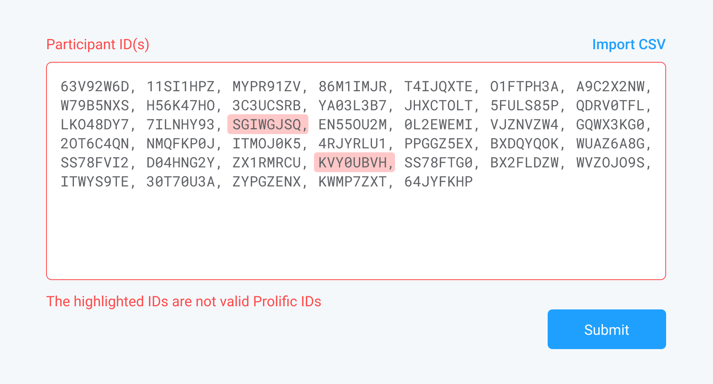

# Prolific Frontend Developer Assignment

## Background
Researchers on Prolific can filter participants using custom block and allow lists. They do this by copy/pasting a list of user IDs into a text box, or by uploading a CSV.

## Task
This repo has the simple backend API implementation (details below). Your task is to create a client side app which:

- Accepts a list of comma or line separated IDs.
- Validates (client side) that IDs are correctly formatted. For the purpose of this exercise, please assume that valid IDs are uppercase alphanumeric and 8 chars in length.
- Validates (client side) the max number of IDs allowed is 5k.
- Validates (client side) that there are no duplicates in the list.
- Validates that the IDs actually exist in the system. This validation is done server-side so the client needs to process the error response to display invalid IDs.
- Displays a simple response message from the server on success response (200) and resets the form. Note also that we've added an artificial delay of 2s to simulate network/processing lag.
- Allows CSV import instead of manual ID input. Note that the backend doesn't accept multipart file attachment data so processing should be done client side.

### API

Start the API by:
- Cloning this repo
- `npm install && npm run start`

The endpoint spec is as follow:
```
curl -id '{"ids":[]}' -H 'Content-Type: application/json' http://localhost:3001/list
HTTP/1.1 400 Bad Request
X-Powered-By: Express
Access-Control-Allow-Origin: *
Content-Type: application/json; charset=utf-8
Content-Length: 55
ETag: W/"37-ls4ZnLD8HSmqrLuIaTCA8ZAVILw"
Date: Thu, 23 Jul 2020 11:26:38 GMT
Connection: keep-alive

{"error":"Property 'ids' must contain at least one ID"}%
```

```
curl -id '{"ids":["12345678"]}' -H 'Content-Type: application/json' http://localhost:3001/list
HTTP/1.1 400 Bad Request
X-Powered-By: Express
Access-Control-Allow-Origin: *
Content-Type: application/json; charset=utf-8
Content-Length: 38
ETag: W/"26-vmZob0taXvZrBmH4onXVjnem9BQ"
Date: Thu, 23 Jul 2020 11:28:01 GMT
Connection: keep-alive

{"error":{"invalid_ids":["12345678"]}}%
```

```
curl -id '{"ids":["PA345678"]}' -H 'Content-Type: application/json' http://localhost:3001/list
HTTP/1.1 200 OK
X-Powered-By: Express
Access-Control-Allow-Origin: *
Content-Type: application/json; charset=utf-8
Content-Length: 23
ETag: W/"17-cH0COv1kxi79nc46PPREcNqaHCU"
Date: Thu, 23 Jul 2020 11:28:56 GMT
Connection: keep-alive

{"success":"IDs saved"}%
```

**NOTE** For the purpose of this exercise, 'real' IDs on the backend have the format `/^P[A-Z\d]{7}$/` (i.e. 8 char uppercase alphanumeric starting with a 'P')

### Bonus (only if time to spare)

- The designer has requested that invalid IDs are highlighted inline, as per the following mockup:




You are free to use any frameworks/libraries of your choice. Your solution only needs to support modern, evergreen browsers (Chrome, Firefox) and desktop only. Please upload sources to Github with instructions on how to build and run.

Questions are welcome and encouraged!